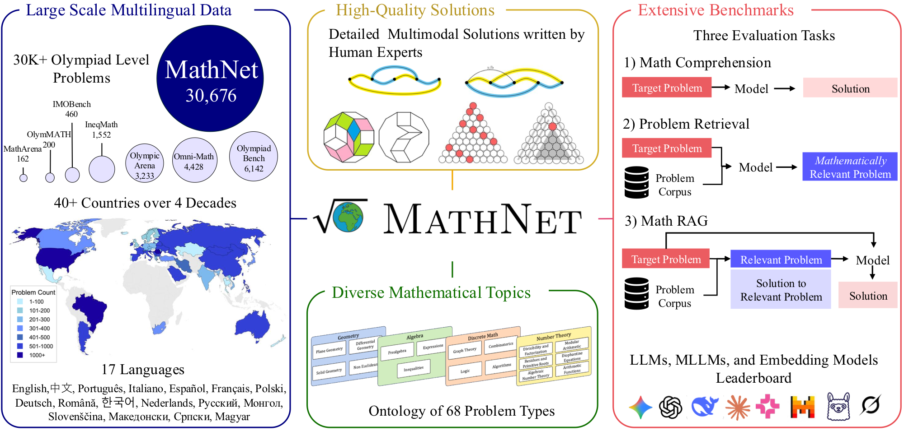
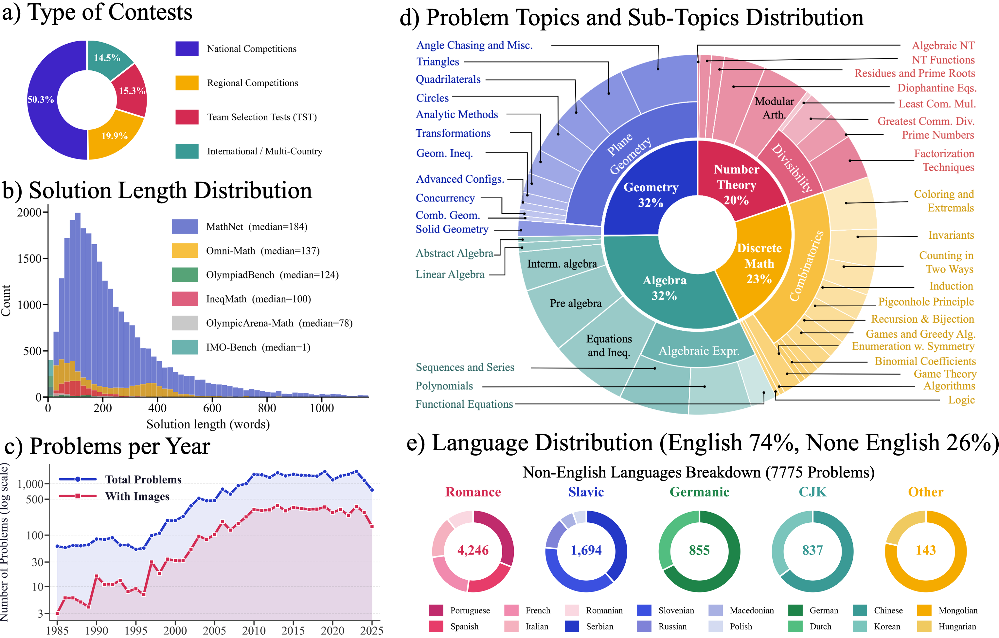
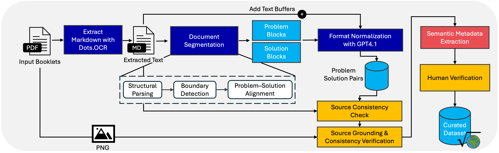

# MathNet — Olympiad Math Reasoning & Retrieval

<div align="center">


<a href="https://mathnet.mit.edu"></a>
<a href="https://arxiv.org/abs/2604.18584"></a>
<a href="https://huggingface.co/datasets/ShadenA/MathNet"></a>

**Shaden Alshammari**<sup>1\*</sup> &ensp; **Kevin Wen**<sup>1\*</sup> &ensp; **Abrar Zainal**<sup>3\*</sup> &ensp; **Mark Hamilton**<sup>1</sup>
**Navid Safaei**<sup>4</sup> &ensp; **Sultan Albarakati**<sup>2</sup> &ensp; **William T. Freeman**<sup>1†</sup> &ensp; **Antonio Torralba**<sup>1†</sup>

<sup>1</sup>MIT &ensp; <sup>2</sup>KAUST &ensp; <sup>3</sup>HUMAIN &ensp; <sup>4</sup>Bulgarian Academy of Sciences &ensp; <sub>\*† equal contribution</sub>

</div>

---

[Quick Start](#quick-start) · [Overview](#overview) · [Tasks](#three-benchmark-tasks) · [Comparison](#how-mathnet-compares-to-existing-math-benchmarks) · [Dataset Stats](#dataset-at-a-glance) · [Data Sources](#data-sources) · [Pipeline](#data-pipeline) · [Schema](#schema) · [Scripts](#scripts) · [License](#license) · [Citation](#citation) · [Useful Links](#useful-links)

---

## Quick Start

### Getting the Data

The MathNet dataset is hosted on Hugging Face due to its large size. To access the data, load it directly using the `datasets` library:

```python
from datasets import load_dataset

# Default: all problems
ds = load_dataset("ShadenA/MathNet", split="train")

# Or a specific country / competition-body config
arg = load_dataset("ShadenA/MathNet", "Argentina", split="train")
apmo = load_dataset("ShadenA/MathNet", "Asia_Pacific_Mathematics_Olympiad_APMO", split="train")

row = ds[0]
print(row["competition"], row["year"], row["country"])
print(row["problem_markdown"])
for img in row["images"]:
    img.show()  # PIL image — renders inline in the HF viewer
```

## Overview



Mathematical problem solving remains a challenging test of reasoning for large language and multimodal models, yet existing benchmarks are limited in size, language coverage, and task diversity. We introduce **MathNet**, a high-quality, large-scale, multimodal, and multilingual dataset of Olympiad-level math problems together with a benchmark for evaluating mathematical reasoning in generative models **and** mathematical retrieval in embedding-based systems.

MathNet spans **47 countries**, **17 languages**, and **two decades** of competitions, comprising **30,676 expert-authored problems with solutions** across diverse domains. Alongside the core dataset, we construct a retrieval benchmark of mathematically equivalent and structurally similar problem pairs curated by human experts.

---

## Three benchmark tasks

| | Task | What it measures |
|---|---|---|
| **I** | **Problem Solving** | Generative models on Olympiad problems, graded against expert solutions |
| **II** | **Math-Aware Retrieval** | Embedding models' ability to retrieve mathematically equivalent / structurally similar problems |
| **III** | **Retrieval-Augmented Problem Solving** | How retrieval quality affects reasoning when similar problems are given as context |

Even state-of-the-art reasoners remain challenged: **78.4% (Gemini-3.1-Pro)** and **69.3% (GPT-5)** on `MathNet-Solve-Test`. Embedding models struggle with equivalence retrieval (Recall@1 under 5% for all tested models), and RAG gains are highly sensitive to retrieval quality — expert retrieval lifts DeepSeek-V3.2-Speciale to **97.3%** on `MathNet-RAG`.

## Dataset at a glance



**What the figure shows.** *(a)* A mix of national, regional, TST, and international competitions. *(b)* MathNet solutions are **substantially longer** than those in prior math benchmarks — long-form proofs, not one-line answers. *(c)* Problems per year — the corpus has grown steadily since the early 2000s. *(d)* Coverage across geometry, algebra, combinatorics, number theory, and their sub-topics. *(e)* **74% English, 26% non-English** across **17 languages**; Portuguese, Spanish, French, Italian, Serbian, Slovenian, German, Chinese, Romanian, Korean, Dutch, Russian, Mongolian, Macedonian, Polish, and Hungarian all appear.

### Topic taxonomy (excerpt)

MathNet ships with a curated olympiad-style taxonomy. Top-level domains include:

- **Geometry** — plane (triangles, quadrilaterals, circles, concurrency/collinearity, transformations, Miquel/Simson/Brocard, geometric inequalities, combinatorial geometry, analytic methods), solid, differential, non-Euclidean
- **Algebra** — prealgebra, polynomials, inequalities, functional equations, sequences/series, linear algebra, abstract algebra
- **Number Theory** — divisibility, primes, modular arithmetic, Diophantine equations, quadratic residues, \(p\)-adic methods
- **Combinatorics** — counting, graph theory, extremal / pigeonhole, invariants/monovariants, games, coloring, generating functions
- **Calculus / Analysis** — limits, inequalities, real analysis, combinatorial analysis
- **Probability & Statistics** — discrete and continuous

Every problem carries a hierarchical topic path (e.g. `Geometry > Plane Geometry > Quadrilaterals > Cyclic quadrilaterals`) usable for stratified evaluation or curriculum construction.

## Data sources

Each year, participating IMO countries contribute original problems for use in their national contests and team selection examinations. MathNet is built from **official problem booklets** collected from **47 countries spanning 1985–2025** — **1,595 PDF volumes** totalling more than **25,000 pages**. Unlike prior math benchmarks that rely on community platforms such as AoPS, every problem and solution in MathNet is authored and disseminated by national teams themselves, ensuring expert-level quality, stylistic consistency, and immunity from the noisy or informal annotations that plague crowd-sourced collections.

A meaningful portion of the collection — particularly older national booklets — was physically obtained and scanned by hand by our IMO expert co-authors, who have attended the International Mathematical Olympiad since 2006 and accumulated a personal archive of official competition materials over nearly two decades.

## Data pipeline



Extracting aligned problem–solution pairs from a heterogeneous corpus of mathematical documents is non-trivial: some booklets separate problems and solutions into different sections, others interleave them; numbering schemes and naming conventions vary across countries and even within a single document. Regex-based heuristics break down at this scale, so we designed a multi-stage LLM pipeline.

**Stage 1 — Document ingestion & segmentation.** All booklets are converted to Markdown via `dots-ocr`, a multilingual document parsing framework designed for both digital typeset PDFs and scanned copies across many languages. `Gemini-2.5-Flash` then identifies problem and solution segments by outputting only their line numbers, and records authors, hints, remarks, source file, and page numbers for provenance.

**Stage 2 — Problem–solution extraction.** Given the line segments from Stage 1, `GPT-4.1` extracts the corresponding problem and solution in LaTeX-friendly Markdown, together with a surrounding text buffer to handle cases where content spans across context boundaries.

**Stage 3 — Extraction verification.** Each extracted pair passes three independent checks before being retained:
1. **Rule-based similarity check** — text similarity between the extraction and original OCR output ensures the LLM made only formatting changes and introduced no hallucinated content.
2. **GPT-4.1-as-judge** — GPT-4.1 compares page screenshots against the extracted pair to catch OCR errors, incorrect figure associations, and incomplete solutions.
3. **Human expert review** — low-confidence cases are manually reviewed by annotators. A pair is retained only if all three mechanisms agree.

Provenance (source booklet, page numbers, authors where given) is preserved on every problem.

## Schema

| Column | Type | Notes |
|---|---|---|
| `unique_id` | string | Stable SHA-256 content hash |
| `country` | string | Country / regional body of origin |
| `competition` | string | e.g. `IMO 2023`, `Cono Sur Mathematical Olympiad` |
| `year` | int32 | Year of competition |
| `section` | string\|null | Day / round / level |
| `problem_number` | string | As printed in the booklet |
| `problem_markdown` | string | Problem statement (Markdown + LaTeX) |
| `solutions_markdown` | list&lt;string&gt; | Official / provided solutions |
| `answers_markdown` | list&lt;string&gt; | Final answers when stated separately |
| `topics` | list&lt;list&lt;string&gt;&gt; | Hierarchical tags |
| `topics_flat` | list&lt;string&gt; | Joined `A > B > C` strings |
| `language` | string | Source booklet language |
| `source_booklet` | string | Booklet id (e.g. `ARG_2003`) |
| `booklet_source` | string | Upstream collection label |
| `has_images` | bool | Whether the problem cites figures |
| `num_images` | int32 | Count of referenced figures |
| `images` | list&lt;Image&gt; | Inlined bytes, decoded to PIL |
| `natural_language_description` | string\|null | LLM-assisted NL rephrasing |
| `main_ideas` | list&lt;string&gt; | LLM-assisted key solution ideas |
| `final_answer` | string\|null | LLM-extracted final answer |
| `problem_type` | string\|null | `proof`, `answer`, `proof and answer`, … |
| `metadata_confidence` | float32 | Self-rated confidence of LLM metadata |
| `original_problem_markdown` | string\|null | Pre-normalization text |

> The enriched fields (`natural_language_description`, `main_ideas`, `final_answer`, `problem_type`, `metadata_confidence`) are **LLM-assisted** and not fully human-audited in the preview. Treat them as convenience annotations, not ground truth.


## Intended uses & limitations

**Good for.** Olympiad-level reasoning evaluation, multilingual math evaluation, figure-grounded multimodal math, topic-stratified analysis, retrieval benchmarks over mathematical structure, and **RL training** — the large pool of expert-written solutions provides dense rewards for verifiable-answer problems, while the math-aware similarity pairs open a new axis: rewarding a model for retrieving a structurally equivalent problem is a natural, automatically verifiable signal that does not require a closed-form answer.

**Caveats.**
- **Not contamination-clean.** Olympiad problems are indexed widely; assume leakage when evaluating pretrained models.
- **Preview schema may change** before the full release.
- **LLM-assisted metadata is imperfect.**

## License

With the kind support of IMO President Gregor Dolinar, we reached out to the leaders of all participating countries and obtained their permission to share this dataset publicly. Where a country or contest organization asserts its own copyright, that copyright is retained and takes precedence — see `competition`, `country`, and `source_booklet` on each row. For all remaining problems where no explicit copyright was asserted, the dataset is released under **[Creative Commons Attribution 4.0 International (CC BY 4.0)](https://creativecommons.org/licenses/by/4.0/)**.

In short: use freely, cite the paper, and respect any explicit rights claimed by the original national team.

If you are a rightsholder with a concern, please open an issue or email [shaden@mit.edu](mailto:shaden@mit.edu).

## Citation

```bibtex
@inproceedings{alshammari2026mathnet,
  title     = {MathNet: A Global Multimodal Benchmark for Mathematical
               Reasoning and Retrieval},
  author    = {Alshammari, Shaden and Wen, Kevin and Zainal, Abrar and
               Hamilton, Mark and Safaei, Navid and Albarakati, Sultan and
               Freeman, William T. and Torralba, Antonio},
  booktitle = {International Conference on Learning Representations},
  year      = {2026},
  url       = {https://mathnet.mit.edu}
}
```

## Useful Links

-  **Website & paper:** <https://mathnet.mit.edu>
- **Browse all 30K problems:** <https://mathnet.mit.edu/explorer.html>
- **Hugging Face Dataset:** <https://huggingface.co/datasets/ShadenA/MathNet>
- **Contact:** [shaden@mit.edu](mailto:shaden@mit.edu)


<p align="center"><sub>© 2026 Massachusetts Institute of Technology · MathNet · ICLR 2026</sub></p>
